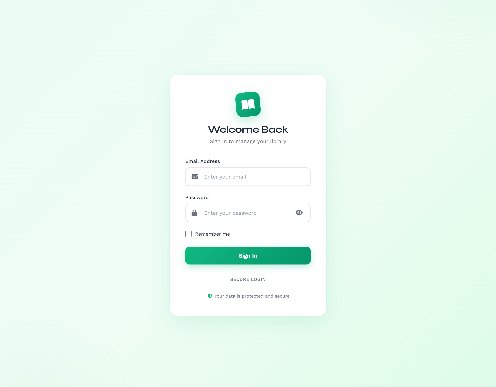
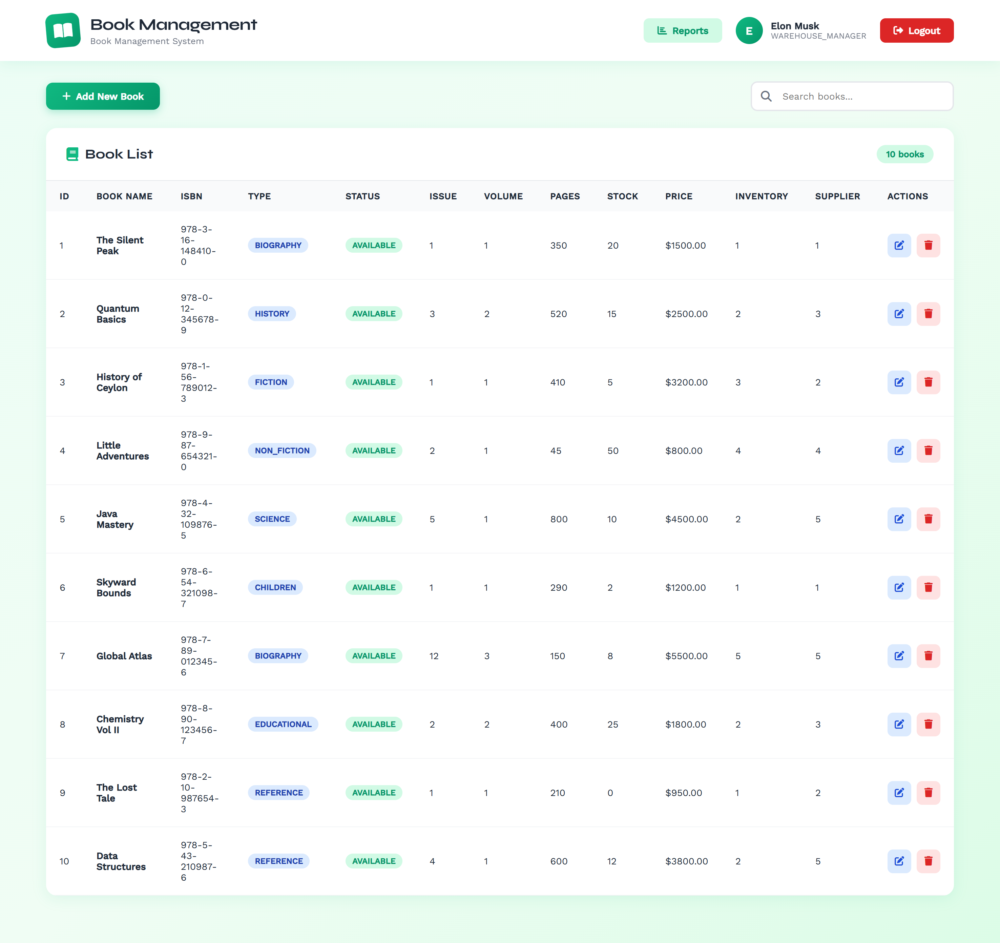
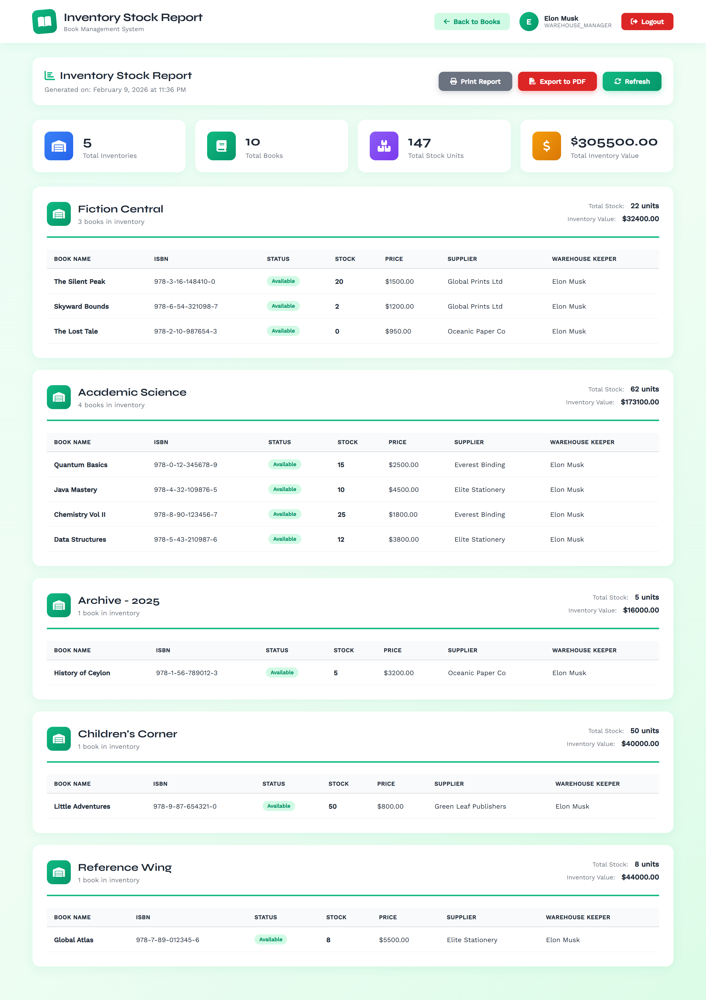
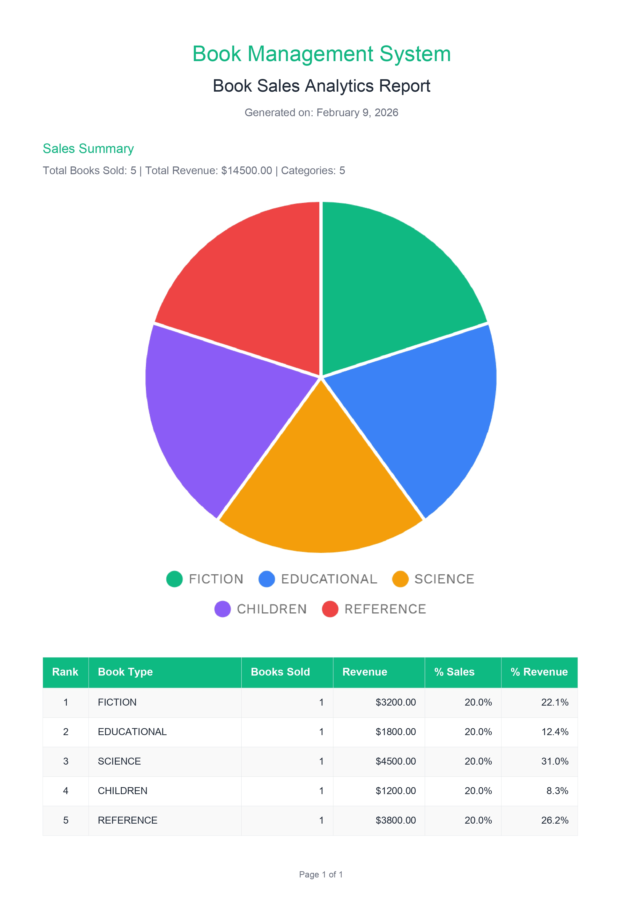

# Book Management System (BMS)

## 1. Introduction
The **Book Management System (BMS)** is an academic software project developed to demonstrate the application of **software engineering principles, object-oriented design, and full-stack web development concepts**.  
The system is designed to support the operational needs of a book-based business by managing key entities such as books, customers, suppliers, and customer orders.

While the **system design covers a complete and extensible solution**, the **implementation is intentionally limited to selected core modules** in order to align with academic time constraints and evaluation requirements.

---

## 2. System Scope and Design Philosophy
This project follows a **design-first approach**, where the entire system was modeled before implementation using standard UML and database modeling techniques.

### Designed System (Conceptual Level)
The following diagrams represent the **complete intended system**:

- [Use Case Diagram](./docs/uml/Use%20Case.png) – captures all functional requirements and actor interactions
- [Class Diagram](./docs/uml/Class.png) – defines the full object-oriented structure and relationships
- [Entity Relationship (ER) Diagram](./docs/uml/ER.png) – models the complete database schema

These diagrams collectively describe a **comprehensive system**, beyond the subset that is currently implemented.

### Implemented System (Practical Level)
Due to academic and project scope limitations, the **implementation focuses on four core entities**, each with complete CRUD functionality:

- Books  
- Customers  
- Suppliers  
- Customer Orders  

This selective implementation demonstrates the **core architecture, data relationships, and reporting logic** of the system, while preserving extensibility for future development.

---

## 3. Functional Features

### 3.1 CRUD Operations
The following modules support full Create, Read, Update, and Delete operations:

- Book Management
- Customer Management
- Supplier Management
- Customer Order Management

Each module follows a layered architecture and adheres to separation of concerns.

---

### 3.2 Reporting and Data Analysis
The system includes multiple analytical reports derived from operational data:

- **Supplier Performance Report**  
  Analyzes supplier activity based on supplied books and order contributions.

- **Inventory Report**  
  Displays current stock information and book availability.

- **Customer Order History Report**  
  Presents historical order data for individual customers.

- **Sales Summary Report**  
  Aggregates sales data to provide a high-level overview of system transactions.

Charts are rendered using **Chart.js**, and report exports are supported using **PDF.js**, enabling structured data visualization and document generation.

---

## 4. Frontend Implementation
The system includes a functional frontend developed using:

- **HTML** for structure
- **CSS** for styling
- **JavaScript with jQuery** for client-side interaction and AJAX communication

The frontend interacts with the backend via RESTful APIs and provides interfaces for:
- CRUD operations
- Report visualization
- Data presentation using charts and generated PDFs

---

## 5. Backend Implementation

### Technologies Used
- **Programming Language:** Java  
- **Framework:** Spring Boot  
- **Database:** MySQL  
- **ORM:** JPA / Hibernate  
- **Build Tool:** Maven  

### Architecture
The backend follows a **layered architecture**, consisting of:
- Controller Layer
- Service Layer
- Repository Layer
- Domain Model and DTOs

This structure promotes maintainability, testability, and scalability.

---

## 6. Academic Learning Outcomes

- Application of UML-based system design
- Mapping conceptual models to practical implementations
- Implementation of CRUD operations using Spring Boot and JPA
- Generation of analytical reports from relational data
- Full-stack integration using RESTful APIs
- Client-side data visualization and PDF generation

---

## 9. Limitations and Future Enhancements

- Authentication and authorization are not implemented
- Only selected modules are implemented at the code level
- Additional use cases defined in the diagrams can be implemented in future iterations
- Advanced filtering, pagination, and role-based access control can be added

## 10. Screenshots

### Login

### Book Management

### Inventory Report Preview

### Exported Report

